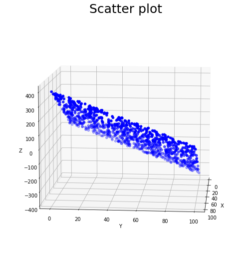
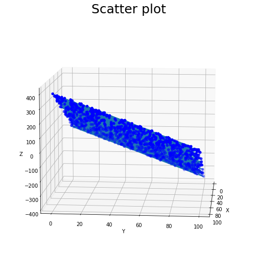

# Microsoft Neural Network Tutorial Homework

### 1.  线性回归模型

给定含有1000条记录的数据集`mlm.csv`，其中每条记录均包含两个自变量`x`,`y`和一个因变量`z`，它们之间存在较为明显的线性关系。

**任务：请对数据进行三维可视化分析，并训练出良好的线性回归模型。**


```python
%matplotlib inline
import pandas as pd
import numpy as np
import matplotlib.pyplot as plt
```


```python
# Read data from local path
path = 'Dataset/mlm.csv'
data = pd.read_csv(path)
data.head()
```


<div>
<style scoped>
    .dataframe tbody tr th:only-of-type {
        vertical-align: middle;
    }

    .dataframe tbody tr th {
        vertical-align: top;
    }
    
    .dataframe thead th {
        text-align: right;
    }
</style>
<table border="1" class="dataframe">
  <thead>
    <tr style="text-align: right;">
      <th></th>
      <th>x</th>
      <th>y</th>
      <th>z</th>
    </tr>
  </thead>
  <tbody>
    <tr>
      <th>0</th>
      <td>64.32</td>
      <td>6.21</td>
      <td>236.522049</td>
    </tr>
    <tr>
      <th>1</th>
      <td>9.76</td>
      <td>86.65</td>
      <td>-283.187014</td>
    </tr>
    <tr>
      <th>2</th>
      <td>18.33</td>
      <td>32.97</td>
      <td>-48.807113</td>
    </tr>
    <tr>
      <th>3</th>
      <td>44.73</td>
      <td>93.60</td>
      <td>-167.729663</td>
    </tr>
    <tr>
      <th>4</th>
      <td>40.39</td>
      <td>27.69</td>
      <td>60.373880</td>
    </tr>
  </tbody>
</table>
</div>


```python
# Plot the data points
fig = plt.figure(figsize=(16,9))
ax = plt.axes(projection='3d')
ax.view_init(elev=10.,azim=5)
ax.set_title('Scatter plot', size=25)
ax.set_xlabel('X')
ax.set_ylabel('Y')
ax.set_zlabel('Z')
ax.scatter3D(data.x,data.y,data.z,c='b',marker='o')
```


    <mpl_toolkits.mplot3d.art3d.Path3DCollection at 0x7f13f01984c0>



​    


```python
# Define the model class
class LinearRegression(object):
    def __init__(self):
        # Random initialize the parameter w
        self.w = np.random.random((2,1))
    
    def predict(self, x):
        return np.matmul(x,self.w)
    
    def fit(self, x, y):
        # Use normal equation to fit
        self.w = np.matmul(np.matmul(np.linalg.inv(np.matmul(x.transpose(),x)),x.transpose()),y)
```


```python
# Preprocess the data
X = np.array(data.drop('z',axis=1))
y = np.array(data['z'])
```


```python
# Instantiate the model
model = LinearRegression()
model.fit(X,y)
print(model.w)
```

    [ 4.05875628 -3.73335026]


```python
# Use RMSE for evaluation
prediction = model.predict(X)
rmse = np.sqrt(((prediction-y)**2).sum()/y.shape[0])
print(rmse)
```

    2.406557290667599


```python
# Plot the data points and the prediction hyperplane
fig = plt.figure(figsize=(16,9))
ax = plt.axes(projection='3d')
ax.view_init(elev=10.,azim=5)
ax.set_title('Scatter plot', size=25)
ax.set_xlabel('X')
ax.set_ylabel('Y')
ax.set_zlabel('Z')
ax.scatter3D(X[:,0],X[:,1],data.z,c='b',marker='o')
ax.plot3D(X[:,0],X[:,1],prediction)
```


    [<mpl_toolkits.mplot3d.art3d.Line3D at 0x7f13f018c250>]


​    

​    

## 2.  非线性多分类器

鸢尾花数据集`iris.csv`含有150条记录，每条记录包含萼片长度`sepal length`、萼片宽度`sepal width`、
花瓣长度`petal length`和花瓣宽度`petal width`四个数值型特征，以及它的所属类别`class`（可能为`Iris-setosa`,`Iris-versicolor`,`Iris-virginica`三者之一）。

**任务：请利用该数据集训练出一个良好的非线性分类器。**


```python
import numpy as np
import pandas as pd
```


```python
# Read data from local path
path = 'Dataset/iris.csv'
data = pd.read_csv(path)
data.head()
```


<div>
<style scoped>
    .dataframe tbody tr th:only-of-type {
        vertical-align: middle;
    }

    .dataframe tbody tr th {
        vertical-align: top;
    }
    
    .dataframe thead th {
        text-align: right;
    }
</style>
<table border="1" class="dataframe">
  <thead>
    <tr style="text-align: right;">
      <th></th>
      <th>sepal length</th>
      <th>sepal width</th>
      <th>petal length</th>
      <th>petal width</th>
      <th>class</th>
    </tr>
  </thead>
  <tbody>
    <tr>
      <th>0</th>
      <td>5.1</td>
      <td>3.5</td>
      <td>1.4</td>
      <td>0.2</td>
      <td>Iris-setosa</td>
    </tr>
    <tr>
      <th>1</th>
      <td>4.9</td>
      <td>3.0</td>
      <td>1.4</td>
      <td>0.2</td>
      <td>Iris-setosa</td>
    </tr>
    <tr>
      <th>2</th>
      <td>4.7</td>
      <td>3.2</td>
      <td>1.3</td>
      <td>0.2</td>
      <td>Iris-setosa</td>
    </tr>
    <tr>
      <th>3</th>
      <td>4.6</td>
      <td>3.1</td>
      <td>1.5</td>
      <td>0.2</td>
      <td>Iris-setosa</td>
    </tr>
    <tr>
      <th>4</th>
      <td>5.0</td>
      <td>3.6</td>
      <td>1.4</td>
      <td>0.2</td>
      <td>Iris-setosa</td>
    </tr>
  </tbody>
</table>
</div>


```python
# data preprocess
X = data.drop(['class'],axis=1)
X = np.array(X)
labels = data['class']
y = []
for label in labels.unique():
    y.append([int(each==label) for each in labels])
y = np.array(y).transpose()
```


```python
# define 2 activation function
class Sigmoid(object):
    @classmethod
    def forward(self,x):
        return 1/(1+np.exp(-x))
    @classmethod
    def backward(self,y):
        return (1-y)*y

class Softmax(object):
    @classmethod
    def forward(self,x):
        return np.exp(x)/np.sum(np.exp(x))
    @classmethod
    def backward(self,y):
        return np.diag(y) - np.outer(y,y)
```


```python
# define the model
class NonlinearClassifier(object):
    '''
    2-layer neural network multiclass-classifier. 
    
    input -> FC -> hidden layer -> FC -> class score -> softmax -> probability
    
    m: the number of input features.
    n: the number of class.
    hidden: the number of hidden layer.
    
    w1,b1: weight and bias between input and hidden layer
    w2,b2: weight and bias between hidden layer and class score
    '''
    def __init__(self, m, hidden, n):
        '''
        Randomly initialize the parameters
        '''
        self.w1 = np.random.random([m,hidden])
        self.b1 = np.random.random(hidden)
        self.w2 = np.random.random([hidden,n])
        self.b2 = np.random.random(n)
        
    def forward(self,x):
        '''
        Forward propagation through all the layers to get the prediction of probability
        '''
        z1 = x.dot(self.w1) + self.b1
        a1 = Sigmoid.forward(z1)
        z2 = a1.dot(self.w2) + self.b2
        output = Softmax.forward(z2)
        return z1,a1,z2,output
    
    def loss(self,output,y):
        '''
        Cross entropy loss for each sample
        '''
        loss = 0
        for i in range(output.shape[0]):
            loss += -y[i]*np.log(output[i])
        return loss
    
    def train(self, X, y, lr = 0.003,iteration = 1000, print_every = None):
        '''
        Use batch gradient decent for optimizer.
        dx means dloss/dx
        '''
    
        for ii in range(iteration):
            delta_w1 = 0
            delta_b1 = 0
            delta_w2 = 0
            delta_b2 = 0
            loss = 0
            
            for i in range(X.shape[0]):
                x = X[i]
                z1, a1, z2, output = self.forward(x)
                
                loss += self.loss(output,y[i])
                dz2 = output - y[i]
                dw2 = np.outer(a1, dz2)
                db2 = dz2
                da1 = self.w2.dot(dz2)
                dz1 = Sigmoid.backward(a1)*da1
                dw1 = np.outer(x,dz1)
                db1 = dz1
                
                delta_w1 += dw1
                delta_b1 += db1
                delta_w2 += dw2
                delta_b2 += db2
              
            if(print_every != None and ii%print_every == 0):
                print('loss:',loss)
                
            self.w1 -= lr*delta_w1
            self.b1 -= lr*delta_b1
            self.w2 -= lr*delta_w2
            self.b2 -= lr*delta_b2
                
    def predict(self,X):
        '''
        transform probability to the label vector
        '''
        prediction = []
        for i in range(X.shape[0]):
            x = X[i]
            _, _, _, output = self.forward(x)
            maxn = np.argmax(output)
            prediction.append([int(j==maxn) for j in range(output.shape[0])])
        return np.array(prediction)
```


```python
def score(prediction,y):
    '''
    Use precision for score
    '''
    total = y.shape[0]
    correct = 0
    for i in range(total):
        if (y[i] == prediction[i]).all():
            correct += 1
    return correct/total
```


```python
hidden_dim = 5
model = NonlinearClassifier(X.shape[1],hidden_dim,y.shape[1])
model.train(X,y,lr=0.001,iteration = 3000,print_every=500)
```

    loss: 167.0489792333817
    loss: 68.43315497830923
    loss: 50.834311845734575
    loss: 45.65566343282708
    loss: 41.772677788353135
    loss: 39.06841936661903


```python
prediction = model.predict(X)
precision = score(prediction,y)
print(precision)
```

    0.96


